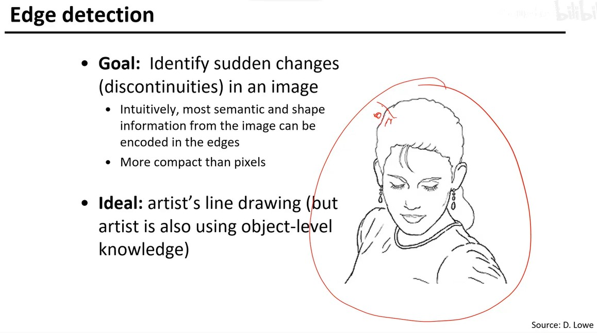

# 2-边缘提取

## 1. 边缘

### 1.1 什么是边缘

边缘代表了**像素值突变**的部分。

### 1.2 边缘的分类

* **surface normal discontinuity**: 面上的不连续，两个面交接的地方（法向不连续）
* **depth discontinuity**: 深度上的不连续，因为看不到后面而形成的边
* **surface color discontinuity**
* **illumination discontinuity**: 阴影边（**光线不连续**），多用于**定位**

## 2. 边缘的提取

### 2.1 基本思路

我们通过对图像求**一阶导**之后求出**一阶导的极值**，即可得到变化最剧烈的点，即突变点，从而找到边缘。

### 2.2 离散一阶导的求法

实际上，求导操作转化为了**卷积操作**。例如，对 $x$ **方向求导**的卷积核为
$$
\left[
\begin{matrix}
0 & -1 & 1
\end{matrix}
\right]
$$
对 $y$ **方向求导**的卷积核为
$$
\left[
\begin{matrix}
0\\
-1\\
1
\end{matrix}
\right]
$$

### 2.3 几种常用的求导卷积核

#### 2.3.1 上述卷积核的变形

$$
\left[
\begin{matrix}
-1 & 0 & 1
\end{matrix}
\right]
$$

#### 2.3.2 Prewitt 算子

$$
M_x=\left[
\begin{matrix}
-1 & 0 & 1 \\
-1 & 0 & 1 \\
-1 & 0 & 1
\end{matrix}
\right]
\quad
M_y=\left[
\begin{matrix}
1 & 1 & 1 \\
0 & 0 & 0 \\
-1 & -1 & -1
\end{matrix}
\right]
$$

考虑了更多的像素点，**对单个噪声点更加稳定**。

#### 2.3.3 Sobel 算子

$$
M_x=\left[
\begin{matrix}
-1 & 0 & 1 \\
-2 & 0 & 2 \\
-1 & 0 & 1
\end{matrix}
\right]
\quad
M_y=\left[
\begin{matrix}
1 & 2 & 1 \\
0 & 0 & 0 \\
-1 & -2 & -1
\end{matrix}
\right]
$$

其中，
$$
M_x = \left[
\begin{matrix}
1 \\
2 \\
1
\end{matrix}
\right]
\left[
\begin{matrix}
-1 & 0 & 1
\end{matrix}
\right]
$$
即 $M_x$ 可转化为两个向量相乘的形式，加速了卷积运算。发现 $M_x$ 相当于先滤波再提取边缘，对噪声的敏感程度会低一些。

#### 2.3.4 Roberts 算子

$$
M_x=\left[
\begin{matrix}
0 & 1 \\
-1 & 0
\end{matrix}
\right]
\quad
M_y=\left[
\begin{matrix}
1 & 0 \\
0 & -1
\end{matrix}
\right]
$$

$M_x$ 可用于检测 $135^\circ$ 的边缘，$M_y$ 可用于检测 $45^\circ$ 的边缘。

### 2.4 梯度

1. 梯度反映了图像**增长最快**的方向。
2. 梯度方向与边缘方向**垂直**。
3. 梯度的幅值 $||\nabla f||$ 越大，越有可能为边缘。

## 3. 考虑噪声影响的边缘提取

### 3.1 噪声的影响

由于噪声的存在，导致求出一阶导之后**无法分辨出边缘**。

### 3.2 对噪声的预处理

我们可以先对图像通过**高斯滤波**进行**平滑处理**之后，再去求一阶导，这样就可以清晰地得到边缘了。

**存在的问题**：图像需要经过两次卷积，比较费时。

### 3.3 对 3.2 的性能优化

通过卷积的**交换律**和结合律，先对**卷积核求一阶导**（得到了**高斯偏导模板**），然后直接对图像进行**一次**卷积即可得到相同的结果，优化了性能。

### 3.4 高斯偏导模板的性质

高斯偏导模板**不可分离**。

增大高斯偏导核的 $\sigma$ 就会使得图像变得**更加模糊**，即**失去了更多细节**。

### 3.5 高斯平滑核和高斯偏导核

#### 3.5.1 高斯平滑核

* 高斯平滑核是低通滤波核
* 高斯平滑核矩阵中的值均为正数
* 高斯平滑核的元素和为 $1$，这保证了常值的部分不会受到高斯平滑核的影响

#### 3.5.2 高斯偏导核

* 高斯偏导核即对高斯核进行**一阶导求导**
* 高斯平滑核矩阵中的值可为正数、$0$ 或**负数**
* 高斯平滑核的元素和为 $0$，这保证了常值的部分经过高斯偏导核卷积之后值为 $0$
* **高对比度**的部分对应的高斯偏导核的卷积值的**绝对值更大**

## 4. Canny 边缘提取算法

### 4.1 目前存在的痛点

* 边缘太宽
* 边缘不连续

### 4.2 非最大化抑制（Non-maximum suppression）

对于当前点 $P$，在当前梯度方向上有两个相邻点 $A$ 和 $B$（相邻 $1$ 个像素），则将 $P,A,B$ 三个点的像素值进行比较，只保留**像素值最大的点**。

可通过双线性插值加权之后得到相邻点。

发现**不连续现象**仍然存在。这个现象的原因在于**门限可能设置得过高**。

### 4.3 双门限法（Hysteresis thresholding）

先用**大门限**计算出**部分边缘**，这部分边缘就是真正边缘的一部分。

之后用**低门限**计算剩下的边缘，只有**与大门限对应边缘相连的边缘**才会被认为是真正的边缘。

### 4.4 算法整体流程

